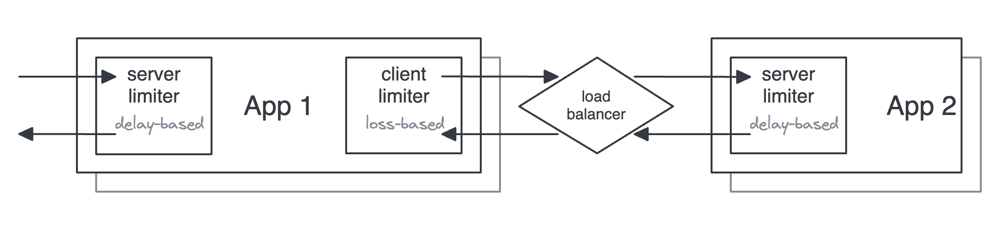

# Squeeze

Dynamic congestion-based concurrency limits for controlling backpressure.

[Documentation](./docs/index.md)

## What is this?

A Rust library to dynamically control concurrency limits. Several algorithms are included, mostly based on TCP congestion control. These detect signs of congestion or overload by observing and reacting to either latency (delay) or load-based failures (loss), respectively. Beyond the limit, additional requests to perform work can be rejected. These rejections can be detected by upstream limiters as load-based failures, acting as an effective form of backpressure.

In general, systems serving clients by doing jobs have a finite number of resources. For example, an HTTP server might have 4 CPU cores available. When these resources become heavily utilised, queues begin to form, and job latency increases. If these queues continue to grow, the system becomes effectively overloaded and unable to respond to job requests in a reasonable time.

These systems can only process so many jobs concurrently. For a purely CPU-bound job, the server above might only be able to process about 4 jobs concurrently. Reality is much more complex, however, and therefore this number is much harder to predict.

Concurrency limits can help protect a system from becoming overloaded, and these limits can be automatically set by observing and responding to the behaviour of the system.

See [background](./docs/background.md) for more details.

## Goals

This library aims to:

1. Achieve optimally high throughput and low latency.
2. Shed load and apply backpressure in response to congestion or overload.
3. Fairly distribute available resources between independent clients with zero coordination.

## Limit algorithms

The congestion-based algorithms come in several flavours:

- **Loss-based** – respond to failed jobs (i.e. overload). Feedback can be implicit (e.g. a timeout) or explicit (e.g. an HTTP 429 or 503 status).
- **Delay-based** – respond to increases in latency (i.e. congestion). Feedback is implicit.

| Algorithm                         | Feedback       | Response             | [Fairness](https://en.wikipedia.org/wiki/Fairness_measure)                                       |
|-----------------------------------|----------------|----------------------|--------------------------------------------------------------------------------------------------|
| [AIMD](src/limit/aimd.rs)         | Loss           | AIMD                 | Fair, but can out-compete delay-based algorithms                                                 |
| [Gradient](src/limit/gradient.rs) | Delay          | AIMD                 | TODO: ?                                                                                          |
| [Vegas](src/limit/vegas.rs)       | Loss and delay | AIAD (AIMD for loss) | [Proportional](https://en.wikipedia.org/wiki/Proportional-fair_scheduling) until overload (loss) |

### Example topology

The example below shows two applications using limiters on the client (output) and on the server (input), using different algorithms for each.



### Caveats

TODO:

- Loss-based algorithms require a reliable signal for load-based errors.
  - If configured to reduce concurrency for non-load-based errors, they can exacerbate availability problems when these errors occur.
- Delay-based algorithms work more reliably with predictable latency.
  - For example, short bursts of increased latency from GC pauses could cause an outsized reduction in concurrency limits.
  - Windowing can help with this.
- Cold-start problem: capacity limits are not known at start up.
  - There's a need to probe to discover this. Requests could be unnecessarily limited until the limit is increased to match capacity.
  - Can be mitigated with single immediate retries (from a token bucket?) on the client, which might get load balanced to a server with available capacity.

## FAQ

> Does this require coordination between multiple processes?

No! The congestion avoidance is based on TCP congestion control algorithms which are designed to work independently. In TCP, each transmitting socket independently detects congestion and reacts accordingly.

## Installing, running and testing

TODO:

## Example

```rust
use std::sync::Arc;
use squeeze::{limits::Aimd, Limiter, Outcome};

// A limiter shared between request handler invocations.
// This controls the concurrency of incoming requests.
let limiter = Arc::new(Limiter::new(
    Aimd::with_initial_limit(10)
        .with_max_limit(20)
        .decrease_factor(0.9)
        .increase_by(1),
));

// A request handler
tokio_test::block_on(async move {
    // On request start
    let token = limiter.try_acquire()
        .await
        .expect("Do some proper error handling instead of this...");

    // Do some work...

    // On request finish
    limiter.release(token, Some(Outcome::Success)).await;
});
```

## Prior art

- Netflix
  - [concurrency-limits](https://github.com/Netflix/concurrency-limits)
  - [Performance Under Load](https://netflixtechblog.medium.com/performance-under-load-3e6fa9a60581)

## Further reading

- [Wikipedia -- TCP congestion control](https://en.wikipedia.org/wiki/TCP_congestion_control)
- [AWS -- Using load shedding to avoid overload](https://aws.amazon.com/builders-library/using-load-shedding-to-avoid-overload/)
- [Sarah-Marie Nothling -- Load Series: Throttling vs Loadshedding](https://sarahnothling.wordpress.com/2019/05/12/load-series-throttling-vs-loadshedding/)
- [Myntra Engineering -- Adaptive Throttling of Indexing for Improved Query Responsiveness](https://medium.com/myntra-engineering/adaptive-throttling-of-indexing-for-improved-query-responsiveness-b3ac949e76c9)
- [TCP Congestion Control: A Systems Approach](https://tcpcc.systemsapproach.org/index.html)
- [LWN -- Delay-gradient congestion control (CDG)](https://lwn.net/Articles/645115/)
- [Strange Loop -- Stop Rate Limiting! Capacity Management Done Right](https://www.youtube.com/watch?v=m64SWl9bfvk)
- [Marc Brooker -- Telling Stories About Little's Law](https://brooker.co.za/blog/2018/06/20/littles-law.html)
- [Queuing theory: Definition, history & real-life applications & examples](https://queue-it.com/blog/queuing-theory/)

## License

Licensed under either of

- Apache License, Version 2.0, ([LICENSE-APACHE](LICENSE-APACHE) or <http://www.apache.org/licenses/LICENSE-2.0>)
- MIT license ([LICENSE-MIT](LICENSE-MIT) or <http://opensource.org/licenses/MIT>)

at your option.

### Contribution

Unless you explicitly state otherwise, any contribution intentionally submitted for inclusion in the work by you, as defined in the Apache-2.0 license, shall be dual licensed as above, without any additional terms or conditions.
